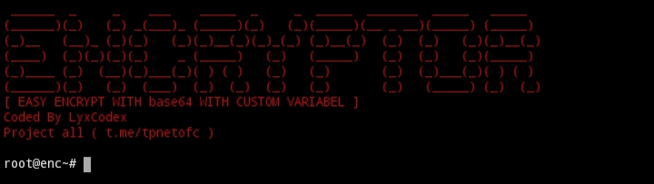

### INTRODUCTION 
This program was created just because I thought, how to run? and what materials must be installed for this script??, you only need to install base64 and to run this program just with python3 enc.py and import the first file and output file


### HOW TO FIX BUG?
Example : `cHJpbnQoImhpIikK
NameError: name 'cHJpbnQoImhpIikK' is not defined` 
**To solve this, you just need to delete it at the end of the program and don't delete the exec program!**

### HOW TO INPUT VARIABEL?
add like this example: 
```python
variable_text = 'Encrypted By LyxCodex'
```

For the `variable_text` section, you can customize it according to your wishes, here I just use the default, namely `variable_text` How can we set the text variables to our liking? add code like this:
```python
variable_texts = "\n".join([variable_text for _ in range(1000)])
```
btw, you can also customize it according to your wishes in the `variable_text` section, I just added S hehehe

to call the variable_text:
look for the decode_and_execute program
```python
decode_and_execute_code = f"""\
#!/usr/bin/env python3
import base64
# 1k Variabel
jkk = '''{variable_texts}'''
def decrypt_script(encoded_content):
    decoded_content = base64.b64decode(encoded_content)
    return decoded_content.decode()

# 2k Variabel
mmk = '''{vartex2}'''

lyxcodex = "{encoded_content.decode('utf-8')}"
decodex = decrypt_script(lyxcodex.encode('utf-8'))
exec(decodex)
"""
```

add the variable earlier, you can see it at **jkk** or **mmk** you can change it however you like♥️

Use default if you don't understand this program🗿
